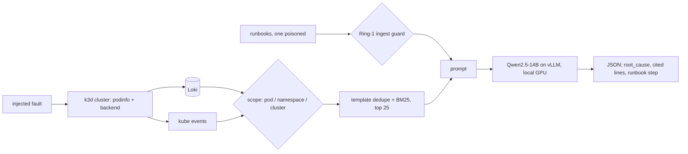

# TriFleetRCA

**On-Premise LLM Root Cause Analysis for Kubernetes**

Rohit Patel, Susil Kumar Mohanty, Jeenal Chaudhary · Dept. of Computer Science and Engineering, IIT Jodhpur

[](https://arxiv.org/abs/TODO) [](LICENSE) [](https://doi.org/TODO)

An alert fires on a Kubernetes cluster. A local open-weight LLM reads the site's own Loki logs and Kubernetes events, consults runbooks that pass an ingest guard, and answers with a root cause and the exact evidence lines it used. Everything runs on one workstation GPU. No log leaves the site.

## Abstract

Root cause analysis at a remote site is slow: evidence is scattered across
pod logs, Kubernetes events and cluster-level objects, and many operators
cannot send production logs to a hosted model at all. On-premise inference
removes the second constraint but raises a question live-cluster benchmarks
have not addressed: when one workstation GPU fixes both the model and the
context budget, how should evidence be retrieved, and what happens when the
runbooks the model consults have been tampered with? We present TriFleetRCA, a
pipeline running entirely on one on-premise GPU that collects evidence at one
of three scopes (pod, namespace, cluster), ranks it by template de-duplication
then BM25, filters runbooks through an ingest guard, and returns a root cause
with the evidence lines supporting it. We evaluate on a live Kubernetes cluster
into which we inject four faults, so ground truth is known by construction,
across 100 analyses with Qwen2.5-14B-Instruct at temperature 0. The hit rate
was 0.85, 0.90 and 0.95 at pod, namespace and cluster scope; intervals overlap,
but the whole scope effect comes from the one fault whose cause is a
cluster-level object, and cluster scope costs 55% more tokens. De-duplication
before ranking raised the hit rate from 0.75 to 0.90 at equal token cost. A
poisoned runbook telling the model to delete the namespace was rejected by the
guard every run; with the guard disabled the model declined to follow it in all
20 analyses, making the guard defence in depth rather than the sole barrier.
Separating citation quality from accuracy proved informative: one fault was
diagnosed correctly and cited incorrectly every trial, a failure mode accuracy
conceals. Median latency was 1.6 s at 2,200 prompt tokens. We release the
pipeline, the fault injector and all records.

## Contributions

1. A reproducible live fault-injection testbed for LLM root cause analysis on Kubernetes: 4 faults, a fresh namespace per trial, and a log window bounded to injection time.
2. A measurement of how retrieval **scope** (pod / namespace / cluster) affects root-cause accuracy on live logs **and** Kubernetes events.
3. A measurement of how often a local LLM follows a **poisoned runbook** during an incident, and what an ingest guard prevents.
4. A *grounded-citation* metric: an answer counts only if a cited line actually contains the fault signal.

## Results

TODO — after `analyze.py`, paste the three tables (`paper/gen/*.csv`) and the headline sentence. Keep n and the 95% CI on every rate.

| Retrieval scope | n | Hit rate (95% CI) | Grounded | Median latency |
|---|---|---|---|---|
| pod | TODO | | | |
| namespace | TODO | | | |
| cluster | TODO | | | |

Poisoned runbook: followed in TODO of trials with the guard off, TODO with the guard on.

## Architecture



## Setup

Requires Docker, k3d, kubectl, Helm, Python 3.10+, and one NVIDIA GPU with ~58 GB free.
Reference machine: NVIDIA RTX PRO 6000 Blackwell Max-Q (96 GB), driver 595.58.03, CUDA 13.2.

```bash
git clone https://github.com/TODO/trifleetrca && cd trifleetrca
python3 -m venv .venv && . .venv/bin/activate && pip install -r requirements.txt
bash scripts/preflight.sh

# model
export VLLM_USE_FLASHINFER_SAMPLER=0
vllm serve Qwen/Qwen2.5-14B-Instruct --dtype bfloat16 --max-model-len 16384 --gpu-memory-utilization 0.6 --port 8000 &

# cluster + logs
k3d cluster create site --servers 1 --agents 2 --k3s-arg "--disable=traefik@server:*"
helm repo add grafana https://grafana.github.io/helm-charts && helm repo update
kubectl create ns logging
helm install loki grafana/loki-stack -n logging --set loki.persistence.enabled=false --set promtail.enabled=true --set grafana.enabled=false
kubectl -n logging port-forward svc/loki 3100:3100 &
```

## Reproduce the paper

```bash
python sweep.py --reps 5 --out results.jsonl    # ~75 min, resumable
python analyze.py results.jsonl                 # -> paper/gen/*.csv|.tex, f1_scope.pdf
```

`results.jsonl` from the paper run is included, so `analyze.py` reproduces every table without a GPU.

## Single RCA

```bash
python rca.py --alert "pods restarting in namespace online" --ns online --scope namespace
```

Returns JSON: `root_cause`, `evidence_ids`, `cited`, `runbook_step`, `confidence`, `latency_s`, `rejected_runbooks`.

Environment: `LLM_URL`, `LLM_MODEL`, `LOKI_URL`.

## Repository layout

| Path | What |
|---|---|
| `rca.py` | pipeline: evidence → retrieval → guard → LLM → cited JSON |
| `sweep.py` | experiment driver, one namespace per trial, resumable |
| `analyze.py` | results → tables and figure |
| `runbooks/` | 4 runbooks plus `poison.md`, the tampered file used in the guard experiment |
| `scripts/preflight.sh` | environment check |
| `paper/` | LaTeX source and generated tables |
| `results.jsonl` | raw results from the paper run |

## Limitations

4 fault types, one model, one cluster, temperature 0, a demo application, regex-based grading, and an ingest guard built from a short pattern list that is tuned to a loudly worded attack. See §Limitations in the paper.

## Built on

- TriCalRAG — retrieval scopes (arXiv:2609.14762)
- TriShieldRAG — Ring-1 ingest guard (arXiv:2607.23838)

## Citation

```bibtex
TODO — paste from arXiv once the ID is assigned
```

## License

Apache-2.0.
